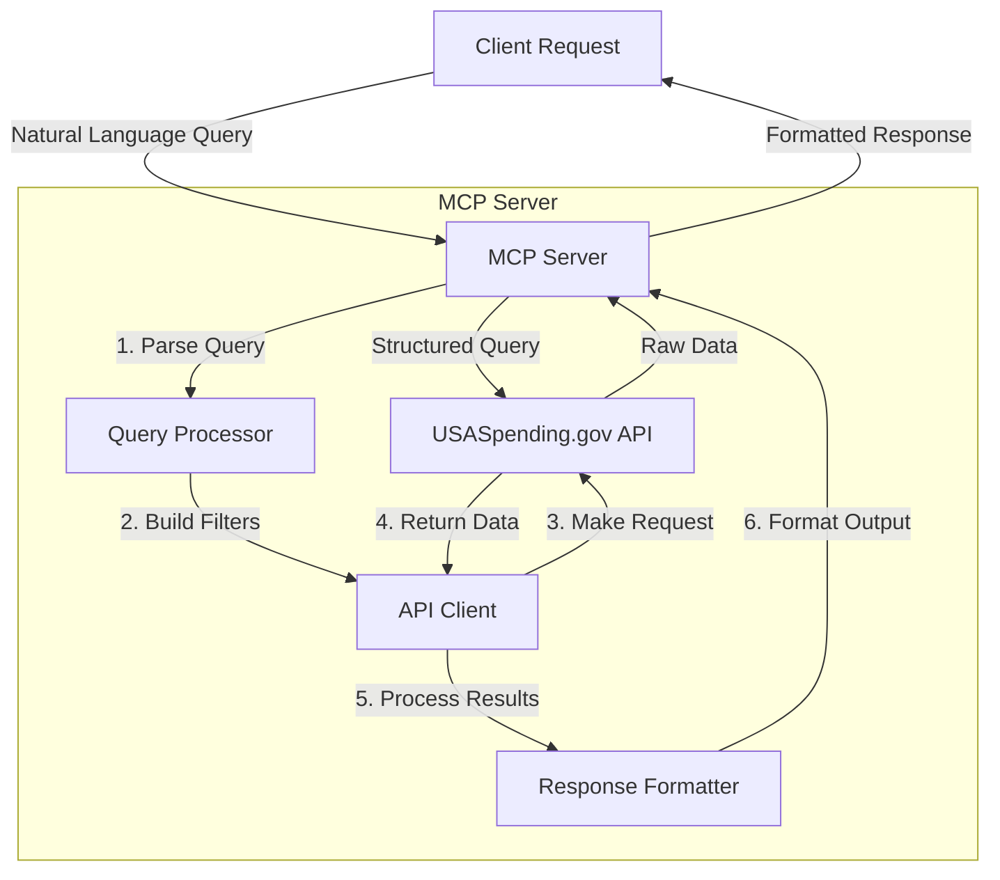
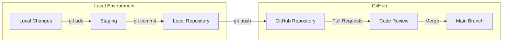
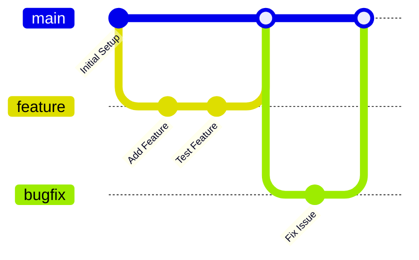
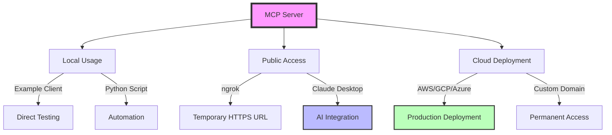
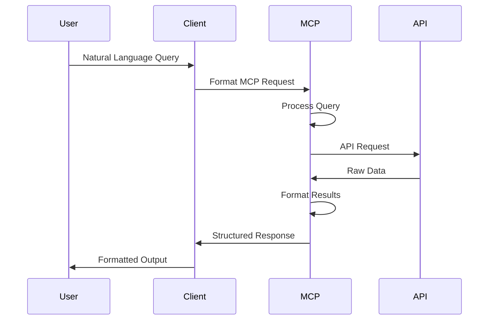
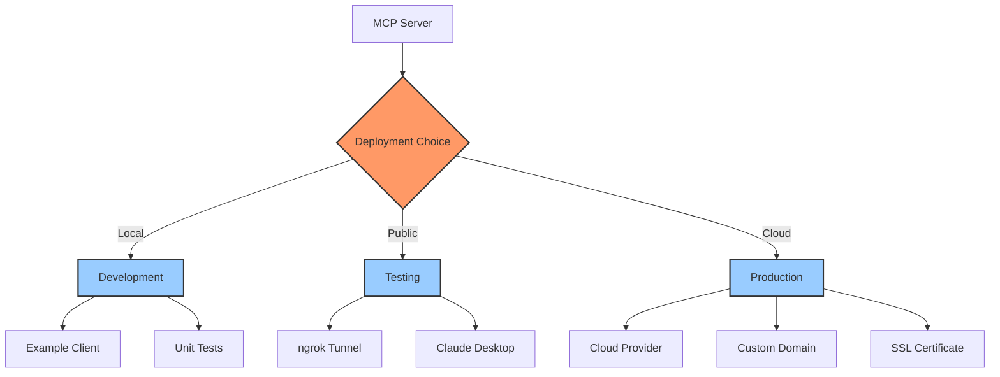

# USASpending MCP Server

An MCP (Model Context Protocol) server that provides natural language access to USASpending.gov data. This server allows you to query federal spending data, including contracts, grants, and other federal awards using natural language queries.

[](https://opensource.org/licenses/MIT)

## License

This project is licensed under the MIT License - see the [LICENSE](LICENSE) file for details.

## Features

- Natural language queries for federal spending data
- Real-time access to USASpending.gov API
- Formatted responses with award details
- Support for filtering by keywords and award types
- Customizable result limits

## Project Structure

```
usaspending-mcp/
├── mcp_server.py      # Main MCP server implementation
├── example_client.py  # Test client for interacting with the server
├── requirements.txt   # Python package dependencies
├── debug_mac.sh      # Debugging script for macOS
└── test_backup/      # Development and test files
```

## Setup

1. Create a Python virtual environment:
```bash
python -m venv venv
source venv/bin/activate  # On Windows: venv\Scripts\activate
```

2. Install dependencies:
```bash
pip install -r requirements.txt
```

## Running the Server

Start the MCP server:
```bash
python mcp_server.py
```

The server will run on `http://127.0.0.1:3002` by default.

## Claude Integration Options

### Important Note About Claude Desktop
As of October 2025, Claude Desktop (including Pro version) cannot directly connect to local MCP servers due to security restrictions. The following options are available for integrating this MCP server with Claude:

1. **Public Hosting with ngrok** (Recommended for testing)
   ```bash
   # Install ngrok
   brew install ngrok  # On macOS
   
   # Start your MCP server
   python mcp_server.py
   
   # In a new terminal, create public HTTPS URL
   ngrok http 3002
   ```
   
   Then update your Claude Desktop configuration:
   ```json
   {
     "tools": [
       {
         "type": "mcp",
         "name": "USASpending API",
         "url": "https://your-ngrok-url",
         "description": "Access and query USASpending.gov data through natural language",
         "enabled": true
       }
     ]
   }
   ```

2. **Cloud Deployment** (Recommended for production)
   - Deploy the MCP server to a cloud provider
   - Use HTTPS endpoints
   - Implement proper authentication
   - Update Claude Desktop config with cloud URL

3. **Claude API Integration** (Alternative approach)
   - Use Claude's API directly instead of Claude Desktop
   - Implement a custom client that combines:
     - Claude API for natural language processing
     - MCP server for data access
   - Requires Claude API access (separate from Claude Desktop)

4. **Standalone Usage**
   - Use the provided example client
   - Implement your own client using the client examples below
   - Good for testing and development

### Claude API Integration Example
```python
import os
import anthropic
import asyncio
import httpx
from typing import Any, Dict, List, Optional
from dataclasses import dataclass

@dataclass
class ClaudeMCPResponse:
    """Structured response from Claude API with MCP integration"""
    text: str
    awards: Optional[List[Dict[str, Any]]] = None
    error: Optional[str] = None

class ClaudeMCPClient:
    """Client for integrating Claude API with MCP server"""
    
    def __init__(
        self,
        claude_api_key: str,
        mcp_server_url: str = "http://127.0.0.1:3002"
    ):
        self.claude = anthropic.Client(api_key=claude_api_key)
        self.mcp_url = mcp_server_url
        self.http_client = httpx.AsyncClient(timeout=60.0)
        
    async def query_mcp(self, tool_name: str, **arguments) -> Dict:
        """Send query to MCP server"""
        payload = {
            "messages": [{
                "role": "user",
                "content": [{
                    "type": "tool_use",
                    "tool_name": tool_name,
                    "tool_arguments": arguments
                }]
            }]
        }
        
        try:
            response = await self.http_client.post(self.mcp_url, json=payload)
            response.raise_for_status()
            return response.json()
        except Exception as e:
            return {"error": str(e)}

    async def process_query(self, user_query: str) -> ClaudeMCPResponse:
        """Process natural language query using Claude and MCP"""
        try:
            # First, use Claude to understand the query
            system_prompt = """
            You are an expert at analyzing queries about federal spending data.
            Convert natural language queries into structured parameters for searching USASpending.gov.
            Focus on extracting: keywords, date ranges, amount ranges, and other relevant filters.
            Respond in JSON format with extracted parameters.
            """
            
            message = anthropic.Message(
                role="user",
                content=f"Convert this query into search parameters: {user_query}"
            )
            
            response = await self.claude.messages.create(
                model="claude-3-opus-20240229",
                system=system_prompt,
                messages=[message],
                temperature=0
            )
            
            # Parse Claude's structured response
            try:
                search_params = response.content[0].text
                # Convert string response to dict if needed
                if isinstance(search_params, str):
                    search_params = json.loads(search_params)
            except Exception as e:
                return ClaudeMCPResponse(
                    text="Error parsing Claude's response",
                    error=str(e)
                )
            
            # Query MCP server with structured parameters
            mcp_response = await self.query_mcp(
                "search_federal_awards",
                query=search_params.get("keywords", user_query),
                max_results=search_params.get("limit", 5)
            )
            
            if "error" in mcp_response:
                return ClaudeMCPResponse(
                    text="Error querying MCP server",
                    error=mcp_response["error"]
                )
            
            # Use Claude to analyze and summarize the results
            analysis_prompt = f"""
            Analyze these federal spending results and provide a clear summary:
            {json.dumps(mcp_response, indent=2)}
            
            Include:
            1. Total number of awards found
            2. Key patterns or trends
            3. Notable awards or recipients
            4. Any interesting insights
            """
            
            analysis_message = anthropic.Message(
                role="user",
                content=analysis_prompt
            )
            
            analysis = await self.claude.messages.create(
                model="claude-3-opus-20240229",
                messages=[analysis_message],
                temperature=0.7  # Allow some creativity in analysis
            )
            
            return ClaudeMCPResponse(
                text=analysis.content[0].text,
                awards=mcp_response.get("response", [])
            )
            
        except Exception as e:
            return ClaudeMCPResponse(
                text="Error processing query",
                error=str(e)
            )
    
    async def close(self):
        """Clean up resources"""
        await self.http_client.aclose()

# Example usage
async def main():
    # Initialize client
    client = ClaudeMCPClient(
        claude_api_key=os.getenv("CLAUDE_API_KEY"),
        mcp_server_url="http://127.0.0.1:3002"
    )
    
    try:
        # Process a natural language query
        result = await client.process_query(
            "Find technology research grants over $1 million in California from last year"
        )
        
        if result.error:
            print(f"Error: {result.error}")
        else:
            print("Analysis:")
            print(result.text)
            print("\nRaw Awards Data:")
            print(json.dumps(result.awards, indent=2))
            
    finally:
        await client.close()

# Run the example
if __name__ == "__main__":
    asyncio.run(main())
```

To use this integration:

1. Install required packages:
```bash
pip install anthropic httpx
```

2. Set up environment variables:
```bash
export CLAUDE_API_KEY="your-api-key-here"
```

3. Create an integration script:
```bash
# Save the above code as claude_mcp_integration.py
python claude_mcp_integration.py
```

This integration provides:
- Natural language query processing using Claude
- Structured parameter extraction
- MCP server interaction
- Result analysis and insights
- Error handling and resource cleanup
- Async support for better performance

The client can be extended with:
- Result caching
- Rate limiting
- Batch processing
- Custom analysis templates
- Export functionality
- Persistent storage

### Security Considerations
When exposing your MCP server publicly:
- Implement authentication
- Use HTTPS endpoints only
- Consider rate limiting
- Monitor for abuse
- Keep dependencies updated
- Follow security best practices for your chosen deployment method

## Client Implementation Examples

### Basic Interactive Client
```python
import asyncio
import httpx
import json

async def query_mcp_server(keyword: str, limit: int = 3) -> dict:
    """Send a query to the MCP server and return results"""
    server_url = "http://127.0.0.1:3002/"
    
    # Construct MCP protocol message
    payload = {
        "messages": [{
            "role": "user",
            "content": [{
                "type": "tool_use",
                "tool_name": "search_federal_awards",
                "tool_arguments": {
                    "query": keyword,
                    "max_results": limit
                }
            }]
        }]
    }
    
    async with httpx.AsyncClient(timeout=60.0) as client:
        response = await client.post(server_url, json=payload)
        response.raise_for_status()
        return response.json()

async def interactive_client():
    """Interactive client with user input"""
    try:
        # Get search parameters
        keyword = input("Enter search keyword: ").strip() or "space"
        try:
            limit = int(input("Enter result limit (default 3): ").strip() or "3")
        except ValueError:
            print("Invalid limit. Using default of 3.")
            limit = 3
            
        print(f"\nSearching for '{keyword}' (limit: {limit})...")
        result = await query_mcp_server(keyword, limit)
        
        # Pretty print the response
        for message in result.get("response", []):
            if message.get("type") == "text":
                print("\nResults:")
                print(message.get("text", "No results"))
                
    except httpx.HTTPError as e:
        print(f"Error connecting to server: {e}")
    except Exception as e:
        print(f"Unexpected error: {e}")

if __name__ == "__main__":
    asyncio.run(interactive_client())
```

### Programmatic Client Example
```python
async def programmatic_client():
    """Example of programmatic usage"""
    queries = [
        ("software development", 2),
        ("construction grants california", 3),
        ("research equipment", 1)
    ]
    
    results = []
    async with httpx.AsyncClient(timeout=60.0) as client:
        for query, limit in queries:
            try:
                response = await query_mcp_server(query, limit)
                results.append({
                    "query": query,
                    "results": response.get("response", [])
                })
            except Exception as e:
                print(f"Error processing query '{query}': {e}")
    
    return results

# Usage example
async def batch_process():
    results = await programmatic_client()
    for entry in results:
        print(f"\nQuery: {entry['query']}")
        for message in entry['results']:
            if message.get("type") == "text":
                print(message.get("text"))
```

### Streaming Client Example
```python
async def stream_results(keyword: str):
    """Example of streaming results as they arrive"""
    async with httpx.AsyncClient(timeout=60.0) as client:
        async def process_chunk(chunk: dict):
            """Process each chunk of results"""
            for message in chunk.get("response", []):
                if message.get("type") == "text":
                    awards = message.get("text", "").split("\n\n")
                    for award in awards:
                        if award.strip():
                            yield award.strip()

        response = await query_mcp_server(keyword, limit=10)
        async for award in process_chunk(response):
            print(f"Found award:\n{award}\n")

# Usage example
async def stream_example():
    print("Streaming results for 'technology'...")
    async for award in stream_results("technology"):
        print(award)
        await asyncio.sleep(0.5)  # Simulate processing time
```

### Error Handling Client Example
```python
class MCPClientError(Exception):
    """Custom error for MCP client operations"""
    pass

async def robust_client(query: str, max_retries: int = 3) -> dict:
    """Client with retry logic and error handling"""
    for attempt in range(max_retries):
        try:
            return await query_mcp_server(query)
        except httpx.ConnectError:
            if attempt == max_retries - 1:
                raise MCPClientError("Could not connect to MCP server")
            await asyncio.sleep(1 * (attempt + 1))  # Exponential backoff
        except httpx.HTTPError as e:
            if e.response.status_code >= 500:
                if attempt == max_retries - 1:
                    raise MCPClientError(f"Server error: {e}")
                await asyncio.sleep(1 * (attempt + 1))
            else:
                raise MCPClientError(f"Client error: {e}")
        except Exception as e:
            raise MCPClientError(f"Unexpected error: {e}")

# Usage example
try:
    result = await robust_client("research grants")
    print(result)
except MCPClientError as e:
    print(f"Error: {e}")
```

### Advanced Query Patterns
```python
class USASpendingQuery:
    """Advanced query builder for USASpending data"""
    def __init__(self):
        self.base_query = ""
        self.filters = []
        self.date_range = None
        self.limit = 10

    def search_text(self, text: str) -> 'USASpendingQuery':
        """Add text search criteria"""
        self.base_query = text
        return self

    def by_state(self, state: str) -> 'USASpendingQuery':
        """Filter by state"""
        self.filters.append(f"in state {state}")
        return self

    def by_amount(self, min_amount: float = None, max_amount: float = None) -> 'USASpendingQuery':
        """Filter by award amount range"""
        if min_amount and max_amount:
            self.filters.append(f"with amount between ${min_amount:,.2f} and ${max_amount:,.2f}")
        elif min_amount:
            self.filters.append(f"with amount greater than ${min_amount:,.2f}")
        elif max_amount:
            self.filters.append(f"with amount less than ${max_amount:,.2f}")
        return self

    def in_date_range(self, start_date: str, end_date: str) -> 'USASpendingQuery':
        """Filter by date range"""
        self.date_range = f"between {start_date} and {end_date}"
        return self

    def limit_results(self, limit: int) -> 'USASpendingQuery':
        """Set result limit"""
        self.limit = limit
        return self

    def build(self) -> tuple[str, int]:
        """Build the natural language query"""
        query_parts = [self.base_query]
        if self.filters:
            query_parts.extend(self.filters)
        if self.date_range:
            query_parts.append(self.date_range)
        return " ".join(query_parts), self.limit

# Usage examples
async def advanced_query_examples():
    # Complex query builder
    query = (USASpendingQuery()
             .search_text("technology research grants")
             .by_state("California")
             .by_amount(min_amount=1000000)
             .in_date_range("2024-01-01", "2025-12-31")
             .limit_results(5))
    
    # Geographic analysis
    states = ["California", "Texas", "New York"]
    state_results = {}
    for state in states:
        query = (USASpendingQuery()
                .search_text("renewable energy")
                .by_state(state)
                .limit_results(3))
        result = await query_mcp_server(*query.build())
        state_results[state] = result

    # Time series analysis
    years = ["2023", "2024", "2025"]
    year_results = {}
    for year in years:
        query = (USASpendingQuery()
                .search_text("artificial intelligence")
                .in_date_range(f"{year}-01-01", f"{year}-12-31")
                .limit_results(3))
        result = await query_mcp_server(*query.build())
        year_results[year] = result
```

### Results Analysis and Processing
```python
from dataclasses import dataclass
from typing import Optional, List
from datetime import datetime
import pandas as pd
import matplotlib.pyplot as plt

@dataclass
class Award:
    """Structured award data"""
    recipient: str
    award_id: str
    amount: float
    award_type: str
    description: str
    date: Optional[datetime] = None

class AwardAnalyzer:
    """Analyze and visualize award data"""
    def __init__(self, awards: List[Award]):
        self.awards = awards
        self.df = self._to_dataframe()

    def _to_dataframe(self) -> pd.DataFrame:
        """Convert awards to pandas DataFrame"""
        return pd.DataFrame([vars(a) for a in self.awards])

    def basic_stats(self) -> dict:
        """Calculate basic statistics"""
        return {
            "total_amount": self.df["amount"].sum(),
            "average_amount": self.df["amount"].mean(),
            "max_amount": self.df["amount"].max(),
            "award_count": len(self.df),
            "unique_recipients": self.df["recipient"].nunique()
        }

    def top_recipients(self, n: int = 5) -> pd.DataFrame:
        """Get top recipients by total award amount"""
        return (self.df.groupby("recipient")
                .agg({"amount": "sum", "award_id": "count"})
                .sort_values("amount", ascending=False)
                .head(n))

    def plot_amount_distribution(self, save_path: str = None):
        """Plot award amount distribution"""
        plt.figure(figsize=(10, 6))
        self.df["amount"].hist(bins=30)
        plt.title("Distribution of Award Amounts")
        plt.xlabel("Amount ($)")
        plt.ylabel("Frequency")
        if save_path:
            plt.savefig(save_path)
        plt.close()

# Usage example
async def analyze_results():
    # Fetch and process awards
    query = USASpendingQuery().search_text("technology research").limit_results(50)
    result = await query_mcp_server(*query.build())
    
    # Parse awards from response
    awards = []
    for msg in result.get("response", []):
        if msg.get("type") == "text":
            # Parse the text response into Award objects
            # (Implementation depends on response format)
            pass
    
    # Analyze results
    analyzer = AwardAnalyzer(awards)
    
    # Generate reports
    stats = analyzer.basic_stats()
    top_recip = analyzer.top_recipients()
    analyzer.plot_amount_distribution("award_distribution.png")
    
    return {
        "statistics": stats,
        "top_recipients": top_recip.to_dict(),
        "visualization": "award_distribution.png"
    }
```

### Integration Examples
```python
from fastapi import FastAPI, BackgroundTasks
from sqlalchemy import create_engine, Column, String, Float, DateTime
from sqlalchemy.ext.declarative import declarative_base
from sqlalchemy.orm import sessionmaker
import slack_sdk
import smtplib
from email.message import EmailMessage

# Database integration
Base = declarative_base()

class AwardRecord(Base):
    """Database model for awards"""
    __tablename__ = "awards"
    
    award_id = Column(String, primary_key=True)
    recipient = Column(String)
    amount = Column(Float)
    description = Column(String)
    date_recorded = Column(DateTime)

# API integration
app = FastAPI()
engine = create_engine("sqlite:///awards.db")
SessionLocal = sessionmaker(bind=engine)

@app.post("/webhook/new-awards")
async def handle_new_awards(background_tasks: BackgroundTasks):
    """Webhook endpoint for processing new awards"""
    # Fetch latest awards
    query = USASpendingQuery().search_text("new technology awards").limit_results(10)
    result = await query_mcp_server(*query.build())
    
    # Process and store awards
    background_tasks.add_task(process_awards, result)
    return {"status": "processing"}

async def process_awards(result: dict):
    """Process awards and integrate with various services"""
    # Store in database
    session = SessionLocal()
    try:
        for award in parse_awards(result):
            db_award = AwardRecord(**award.__dict__)
            session.add(db_award)
        session.commit()
    finally:
        session.close()

    # Send Slack notification
    if significant_awards_found(result):
        await notify_slack(result)

    # Send email report
    await send_email_report(result)

# Slack integration
async def notify_slack(result: dict):
    """Send notification to Slack"""
    client = slack_sdk.WebClient(token="your-token")
    
    blocks = [
        {
            "type": "section",
            "text": {
                "type": "mrkdwn",
                "text": "*New Significant Awards Found*"
            }
        }
    ]
    
    for award in parse_awards(result):
        if award.amount > 1_000_000:  # Significant awards
            blocks.append({
                "type": "section",
                "text": {
                    "type": "mrkdwn",
                    "text": f"*{award.recipient}*\n"
                           f"Amount: ${award.amount:,.2f}\n"
                           f"ID: {award.award_id}"
                }
            })
    
    client.chat_postMessage(channel="#awards", blocks=blocks)

# Email integration
async def send_email_report(result: dict):
    """Send email report"""
    msg = EmailMessage()
    msg.set_content(format_email_content(result))
    msg["Subject"] = "New Awards Report"
    msg["From"] = "awards@example.com"
    msg["To"] = "team@example.com"
    
    # Send email
    with smtplib.SMTP("smtp.example.com", 587) as server:
        server.starttls()
        server.login("user", "password")
        server.send_message(msg)

# Export to CSV
async def export_awards(query_result: dict, filepath: str):
    """Export awards to CSV"""
    awards = parse_awards(query_result)
    df = pd.DataFrame([vars(a) for a in awards])
    df.to_csv(filepath, index=False)

# AWS Integration
import boto3
from botocore.exceptions import ClientError

class AWSIntegration:
    """AWS service integrations for award data"""
    
    def __init__(self):
        self.s3 = boto3.client('s3')
        self.dynamodb = boto3.resource('dynamodb')
        self.sns = boto3.client('sns')
        self.lambda_client = boto3.client('lambda')
        
    async def store_in_s3(self, awards: List[Award], bucket: str):
        """Store awards data in S3"""
        # Convert awards to JSON
        awards_json = json.dumps([vars(a) for a in awards])
        
        # Generate timestamped key
        timestamp = datetime.now().strftime('%Y%m%d_%H%M%S')
        key = f"awards/{timestamp}.json"
        
        try:
            # Upload to S3
            self.s3.put_object(
                Bucket=bucket,
                Key=key,
                Body=awards_json,
                ContentType='application/json'
            )
            return f"s3://{bucket}/{key}"
        except ClientError as e:
            logging.error(f"S3 upload error: {e}")
            raise

    async def store_in_dynamodb(self, awards: List[Award], table_name: str):
        """Store awards in DynamoDB"""
        table = self.dynamodb.Table(table_name)
        
        with table.batch_writer() as batch:
            for award in awards:
                batch.put_item(Item={
                    'award_id': award.award_id,
                    'recipient': award.recipient,
                    'amount': Decimal(str(award.amount)),
                    'description': award.description,
                    'timestamp': datetime.now().isoformat()
                })

    async def notify_large_awards(self, awards: List[Award], topic_arn: str, threshold: float = 1000000):
        """Notify about large awards via SNS"""
        large_awards = [a for a in awards if a.amount > threshold]
        
        if large_awards:
            message = "Large Awards Detected:\n\n"
            for award in large_awards:
                message += f"Recipient: {award.recipient}\n"
                message += f"Amount: ${award.amount:,.2f}\n"
                message += f"ID: {award.award_id}\n\n"
            
            self.sns.publish(
                TopicArn=topic_arn,
                Subject="Large Federal Awards Alert",
                Message=message
            )

    async def trigger_analysis(self, awards: List[Award], function_name: str):
        """Trigger Lambda function for award analysis"""
        payload = {
            'awards': [vars(a) for a in awards],
            'timestamp': datetime.now().isoformat()
        }
        
        self.lambda_client.invoke(
            FunctionName=function_name,
            InvocationType='Event',
            Payload=json.dumps(payload)
        )

# Google Cloud Integration
from google.cloud import storage, bigquery, pubsub_v1

class GCPIntegration:
    """Google Cloud Platform integrations"""
    
    def __init__(self):
        self.storage_client = storage.Client()
        self.bigquery_client = bigquery.Client()
        self.publisher = pubsub_v1.PublisherClient()
        
    async def store_in_gcs(self, awards: List[Award], bucket_name: str):
        """Store awards in Google Cloud Storage"""
        bucket = self.storage_client.bucket(bucket_name)
        timestamp = datetime.now().strftime('%Y%m%d_%H%M%S')
        blob = bucket.blob(f"awards/{timestamp}.json")
        
        awards_json = json.dumps([vars(a) for a in awards])
        blob.upload_from_string(awards_json, content_type='application/json')
        
        return f"gs://{bucket_name}/{blob.name}"

    async def load_to_bigquery(self, awards: List[Award], table_id: str):
        """Load awards into BigQuery"""
        # Convert awards to DataFrame
        df = pd.DataFrame([vars(a) for a in awards])
        
        # Load data to BigQuery
        job_config = bigquery.LoadJobConfig(
            write_disposition="WRITE_APPEND",
            schema=[
                bigquery.SchemaField("award_id", "STRING"),
                bigquery.SchemaField("recipient", "STRING"),
                bigquery.SchemaField("amount", "FLOAT"),
                bigquery.SchemaField("description", "STRING"),
                bigquery.SchemaField("date", "TIMESTAMP")
            ]
        )
        
        job = self.bigquery_client.load_table_from_dataframe(
            df, table_id, job_config=job_config
        )
        job.result()  # Wait for job to complete

    async def publish_to_pubsub(self, awards: List[Award], topic_path: str):
        """Publish awards to Pub/Sub"""
        for award in awards:
            data = json.dumps(vars(award)).encode('utf-8')
            future = self.publisher.publish(topic_path, data)
            future.result()  # Wait for message to be published

# Azure Integration
from azure.storage.blob import BlobServiceClient
from azure.cosmos import CosmosClient
from azure.servicebus import ServiceBusClient

class AzureIntegration:
    """Microsoft Azure integrations"""
    
    def __init__(self, connection_strings: dict):
        self.blob_service = BlobServiceClient.from_connection_string(
            connection_strings['blob'])
        self.cosmos_client = CosmosClient.from_connection_string(
            connection_strings['cosmos'])
        self.servicebus_client = ServiceBusClient.from_connection_string(
            connection_strings['servicebus'])
            
    async def store_in_blob(self, awards: List[Award], container_name: str):
        """Store awards in Azure Blob Storage"""
        container_client = self.blob_service.get_container_client(container_name)
        timestamp = datetime.now().strftime('%Y%m%d_%H%M%S')
        blob_name = f"awards/{timestamp}.json"
        
        awards_json = json.dumps([vars(a) for a in awards])
        container_client.upload_blob(
            name=blob_name,
            data=awards_json,
            overwrite=True
        )
        
        return f"https://<account>.blob.core.windows.net/{container_name}/{blob_name}"

    async def store_in_cosmos(self, awards: List[Award], database_name: str, container_name: str):
        """Store awards in Cosmos DB"""
        database = self.cosmos_client.get_database_client(database_name)
        container = database.get_container_client(container_name)
        
        for award in awards:
            item = {
                'id': award.award_id,
                'recipient': award.recipient,
                'amount': award.amount,
                'description': award.description,
                'timestamp': datetime.now().isoformat(),
                'type': 'award'
            }
            container.upsert_item(item)

    async def send_to_service_bus(self, awards: List[Award], queue_name: str):
        """Send awards to Azure Service Bus"""
        async with self.servicebus_client:
            sender = self.servicebus_client.get_queue_sender(queue_name)
            async with sender:
                for award in awards:
                    message = json.dumps(vars(award))
                    await sender.send_messages(message)

# Example usage of cloud integrations
async def cloud_integration_example():
    # Fetch awards
    query = USASpendingQuery().search_text("technology grants").limit_results(10)
    result = await query_mcp_server(*query.build())
    awards = parse_awards(result)
    
    # AWS Integration
    aws = AWSIntegration()
    s3_path = await aws.store_in_s3(awards, 'my-awards-bucket')
    await aws.store_in_dynamodb(awards, 'federal-awards')
    await aws.notify_large_awards(awards, 'arn:aws:sns:region:account:topic')
    
    # GCP Integration
    gcp = GCPIntegration()
    gcs_path = await gcp.store_in_gcs(awards, 'my-awards-bucket')
    await gcp.load_to_bigquery(awards, 'project.dataset.awards_table')
    
    # Azure Integration
    azure = AzureIntegration({
        'blob': 'connection_string',
        'cosmos': 'connection_string',
        'servicebus': 'connection_string'
    })
    blob_url = await azure.store_in_blob(awards, 'awards-container')
    await azure.store_in_cosmos(awards, 'AwardsDB', 'FederalAwards')
```

## Using the Example Client

The example client provides a simple way to test the server:
```bash
python example_client.py
```

You'll be prompted to:
1. Enter a search keyword (e.g., 'space', 'dell', 'construction')
2. Specify the number of results to show

## Available Tools

### search_federal_awards
Query federal spending data with natural language. Examples:
- Search for software development contracts
- Find construction grants in specific states
- Look up technology research funding
- Find training and education contracts

## Debugging

If you encounter issues:
1. Run the debugging script:
```bash
bash debug_mac.sh
```
2. Check the server logs for detailed error messages
3. Verify the USASpending.gov API status

## Notes

- The server uses the USASpending.gov API v2
- Response times may vary based on the complexity of the query
- Result limits are capped at 100 items per query
- Award amounts are formatted for readability (K for thousands, M for millions, B for billions)

## Technical Implementation Details

### MCP Server Architecture

The server implements the Model Context Protocol (MCP) specification, which enables AI models to interact with external tools. Key components:

1. **Server Core (`mcp_server.py`)**
   - Uses FastAPI for the HTTP server
   - Implements the MCP protocol handlers
   - Manages tool registration and execution
   - Handles request/response formatting

   ```python
   # Server initialization
   app = Server("usaspending-server")
   fastapi_app = FastAPI()
   
   # HTTP client setup with timeout
   http_client = httpx.AsyncClient(timeout=30.0)
   
   # Main request handler
   @fastapi_app.post("/")
   async def handle_mcp_request(request: Request) -> JSONResponse:
       try:
           body = await request.json()
           messages = body.get("messages", [])
           
           responses = []
           for msg in messages:
               if msg.get("role") == "user":
                   for content in msg.get("content", []):
                       if content.get("type") == "tool_use":
                           responses.extend(
                               await call_tool(
                                   content.get("tool_name"),
                                   content.get("tool_arguments", {})
                               )
                           )
           
           return JSONResponse(content={"response": responses})
       except Exception as e:
           return JSONResponse(
               status_code=500,
               content={"error": str(e)}
           )
   ```

2. **Tool Implementation**
   ```python
   @app.list_tools()
   async def list_tools() -> list[Tool]:
       # Defines available tools and their schemas
   
   @app.call_tool()
   async def call_tool(name: str, arguments: Any):
       # Handles tool execution
   ```

3. **Request Flow**
   ```
   Client Request → MCP Server → Tool Handler → USASpending API → Response Formatting → Client
   ```

### API Integration

1. **USASpending.gov API v2**
   - Endpoint: `https://api.usaspending.gov/api/v2`
   - Uses async HTTP client (httpx) for non-blocking requests
   - Implements connection pooling and timeout handling

2. **Query Processing**
   ```python
   async def search_awards(args: dict) -> list[TextContent]:
       """Search for federal awards with detailed filtering"""
       # Build query filters
       filters = {
           "keywords": [args.get("keywords", "")],
           "award_type_codes": ["A", "B", "C", "D"],  # Contracts
           "time_period": [{
               "start_date": "2019-10-01",
               "end_date": "2025-09-30"
           }]
       }
       
       # Get total count first
       count_result = await make_api_request(
           "search/spending_by_award_count",
           json_data={"filters": filters},
           method="POST"
       )
       
       # Then get detailed results
       payload = {
           "filters": filters,
           "fields": [
               "Award ID",
               "Recipient Name",
               "Award Amount",
               "Description",
               "Award Type"
           ],
           "page": 1,
           "limit": min(args.get("limit", 10), 100)
       }
       
       result = await make_api_request(
           "search/spending_by_award",
           json_data=payload,
           method="POST"
       )
       
       # Format response
       awards = result.get("results", [])
       if not awards:
           return [TextContent(
               type="text",
               text="No awards found matching your criteria."
           )]
           
       # Build formatted response
       output = format_award_results(awards)
       return [TextContent(type="text", text=output)]
   ```

3. **Response Formatting**
   - Implements currency formatting (K, M, B notation)
   - Truncates long descriptions
   - Structures data hierarchically

### MCP Protocol Specifics

1. **Tool Definition**
   ```json
   {
     "name": "search_federal_awards",
     "description": "Search federal spending data...",
     "inputSchema": {
       "type": "object",
       "properties": {
         "query": {
           "type": "string",
           "description": "Natural language query"
         },
         "max_results": {
           "type": "integer",
           "description": "Maximum results"
         }
       }
     }
   }
   ```

2. **Message Format**
   ```json
   {
     "messages": [{
       "role": "user",
       "content": [{
         "type": "tool_use",
         "tool_name": "search_federal_awards",
         "tool_arguments": {
           "query": "construction grants",
           "max_results": 5
         }
       }]
     }]
   }
   ```

### Performance Optimizations

1. **Caching**
   ```python
   from functools import lru_cache
   
   @lru_cache(maxsize=100)
   async def cached_api_request(endpoint: str, query_hash: str) -> dict:
       """Cache API responses for frequently used queries"""
       return await make_api_request(endpoint, json_data=json.loads(query_hash))
   
   # Usage example
   query_hash = hash_dict(filters)  # Convert dict to stable hash
   results = await cached_api_request("search/spending_by_award", query_hash)
   ```

2. **Async Implementation**
   ```python
   async def parallel_api_requests(queries: list) -> list:
       """Execute multiple API requests concurrently"""
       async with httpx.AsyncClient() as client:
           tasks = [
               client.post(
                   f"{BASE_URL}/{query['endpoint']}",
                   json=query['data']
               )
               for query in queries
           ]
           responses = await asyncio.gather(*tasks)
           return [r.json() for r in responses]
   
   # Usage example
   results = await parallel_api_requests([
       {"endpoint": "search/spending_by_award_count", "data": count_payload},
       {"endpoint": "search/spending_by_award", "data": search_payload}
   ])
   ```

3. **Resource Management**
   ```python
   async def run_server():
       """Run server with proper resource management"""
       # Initialize HTTP client
       http_client = httpx.AsyncClient(
           timeout=30.0,
           limits=httpx.Limits(
               max_keepalive_connections=20,
               max_connections=50
           )
       )
       
       try:
           # Start server
           logger.info("Starting server on http://127.0.0.1:3002")
           config = uvicorn.Config(
               app=fastapi_app,
               host="127.0.0.1",
               port=3002,
               log_level="info"
           )
           server = uvicorn.Server(config)
           
           # Handle shutdown gracefully
           await server.serve()
           
       except Exception as e:
           logger.error(f"Server error: {str(e)}")
       finally:
           # Clean up resources
           await http_client.aclose()
           logger.info("Server shutdown complete")
   
   if __name__ == "__main__":
       asyncio.run(run_server())
   ```

## Error Handling

The server includes comprehensive error handling for:
- API connection issues
- Invalid queries
- Rate limiting
- Malformed responses

## Future Enhancements

Planned features:
- Additional query filters (date ranges, award types)
- Aggregate spending analytics
- Geographic visualization
- Export capabilities

## Publishing and Contributing

### Project Architecture



### Publishing Workflow



### Development Process



### MCP Integration Options



### Initial Setup and Publishing to GitHub

1. **Prepare Your Project**
   ```bash
   # Create .gitignore file for Python projects
   cat > .gitignore << EOL
   # Python
   __pycache__/
   *.py[cod]
   venv/
   *.so
   .Python
   build/
   dist/
   *.egg-info/

   # Environment
   .env
   .env.local
   claude_desktop_config.json

   # IDE
   .vscode/
   .idea/

   # OS
   .DS_Store
   Thumbs.db

   # Testing
   .coverage
   htmlcov/
   test_backup/
   EOL

   # Add MIT License
   # Create LICENSE file with MIT License text

   # Ensure README.md is complete
   # Add project description, setup instructions, and usage examples
   ```

2. **Initialize Git Repository**
   ```bash
   # Initialize new repository
   git init

   # Add all files
   git add .

   # Make initial commit
   git commit -m "Initial commit: USASpending MCP Server implementation"
   ```

3. **Connect to GitHub**
   ```bash
   # Add GitHub repository as remote
   git remote add origin https://github.com/WebDev70/USASpending_MCP_Server.git

   # Rename default branch to main
   git branch -M main
   ```

4. **Handle Existing Remote Content**
   ```bash
   # Configure git pull strategy
   git config pull.rebase false

   # Pull existing content (if any)
   git pull origin main --allow-unrelated-histories

   # Resolve any merge conflicts
   # Edit conflicting files manually
   git add .
   git commit -m "Resolved merge conflicts"
   ```

5. **Push to GitHub**
   ```bash
   # Push to GitHub
   git push -u origin main
   ```

### Making Changes

1. **Create New Branch**
   ```bash
   # Create and switch to new branch
   git checkout -b feature/new-feature
   ```

2. **Make Changes**
   ```bash
   # Edit files
   # Test changes
   # Update documentation

   # Add and commit changes
   git add .
   git commit -m "Description of changes"
   ```

3. **Push Changes**
   ```bash
   # Push to GitHub
   git push origin feature/new-feature
   ```

4. **Create Pull Request**
   - Go to GitHub repository
   - Click "Compare & pull request"
   - Describe your changes
   - Submit pull request

### Data Flow and Processing



### Deployment Options



### Best Practices

1. **Before Publishing**
   - Remove sensitive information
   - Update requirements.txt
   - Test all functionality
   - Complete documentation
   - Add license information

2. **Commit Messages**
   - Use clear, descriptive messages
   - Start with verb (Add, Update, Fix, etc.)
   - Reference issues if applicable

3. **Branch Management**
   - Use feature branches for new work
   - Keep main branch stable
   - Delete merged feature branches

4. **Security**
   - Never commit API keys
   - Use environment variables
   - Keep dependencies updated
   - Review access permissions
=======
# USASpending_MCP_Server
An MCP (Model Context Protocol) server that provides natural language access to USASpending.gov data. This server allows you to query federal spending data, including contracts, grants, and other federal awards using natural language queries.
>>>>>>> c08a52e442638be8d9927d900c400324876331f7
