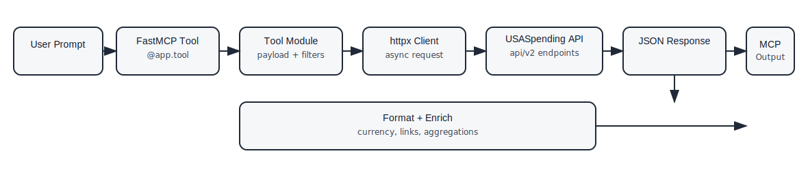

# USASpending MCP Server with FAR Regulatory Toolzzzzzzzzzzz

A FastMCP server that provides access to USASpending.gov federal spending data and FAR (Federal Acquisition Regulation) lookup tools through the Model Context Protocol (MCP). Query contracts, grants, loans, and other federal awards using natural language, and reference procurement regulations instantly.

[](https://opensource.org/licenses/MIT)

## Features

- 🔍 **Natural language queries** for federal spending data
- ⚖️ **Multi-part FAR lookup tools** for procurement professionals (Parts 14, 15, 16, 19)
  - `lookup_far_section` - Direct section lookup by number (auto-detects part)
  - `search_far` - Cross-part keyword search with relevance scoring
  - `list_far_sections` - Complete FAR index (210 sections across all parts)
- 🚀 **FastMCP integration** for modern MCP protocol support
- 🔌 **Dual transport modes**: stdio (testing) and HTTP (Claude Desktop)
- 📊 **Real-time data** from USASpending.gov API
- 💰 **Smart currency formatting** (B/M/K notations)
- 🛠️ **Easy testing** with included MCP client

## Quick Start

### 1. Setup

```bash
# Clone the repository
git clone https://github.com/WebDev70/USASpending_MCP_Server.git
cd usaspending-mcp

# Create virtual environment
python -m venv .venv
source .venv/bin/activate  # On Windows: .venv\Scripts\activate

# Install dependencies
pip install -e ".[dev]"
```

### 2. Test the Server

```bash
# Run the test client (recommended)
./test_mcp_client.sh

# Or run directly
PYTHONPATH=src ./.venv/bin/python -m usaspending_mcp.client
```

**Example queries:**
- "space" - Find space-related contracts
- "software development" - Search for software contracts
- "construction" - Find construction projects

### 3. Docker Quick Start (Optional)

For containerized deployment:

```bash
# Build and run with Docker Compose
docker-compose up

# Or build and run manually
docker build -t usaspending-mcp .
docker run -p 3002:3002 usaspending-mcp
```

See `DOCKER_GUIDE.md` for complete Docker setup and deployment options.

### 4. Use with Claude Desktop

```bash
# Start the HTTP server
./start_mcp_server.sh
```

Then configure Claude Desktop to connect to `http://localhost:3002/mcp`

## Documentation Guide

New to the project? Start here:

- **📚 [Documentation Roadmap](docs/DOCUMENTATION_ROADMAP.md)** - Choose your learning path based on your role:
  - First-time user (15 min)
  - Developer (1-2 hours)
  - DevOps/Operations (1-2 hours)
  - Government analyst/Procurement professional (1.5 hours)
  - Architect/Technical lead (2 hours)

After the quick start above, the roadmap will guide you to the most relevant documentation for your needs.

## Project Structure

```
usaspending-mcp/
├── src/usaspending_mcp/           # Main package (production code)
│   ├── __init__.py                # Package initialization & exports
│   ├── server.py                  # FastMCP server with all tools
│   ├── client.py                  # MCP test/debug client
│   ├── tools/                     # MCP tool modules
│   │   ├── __init__.py
│   │   └── far.py                 # FAR (Part 14, 15, 16, 19) tools
│   ├── loaders/                   # Data loading utilities
│   │   ├── __init__.py
│   │   └── far.py                 # FAR data loaders
│   └── data/                      # Runtime data files
│       ├── __init__.py
│       └── far/                   # FAR regulatory data (Parts 14, 15, 16, 19)
│           ├── __init__.py
│           ├── far_part14.json
│           ├── far_part15.json
│           ├── far_part16.json
│           └── far_part19.json
├── docs/                          # Documentation
│   ├── guides/                    # User guides & tutorials
│   │   ├── QUICKSTART.md
│   │   ├── STRUCTURED_LOGGING_GUIDE.md
│   │   ├── CONVERSATION_LOGGING_GUIDE.md
│   │   ├── RATE_LIMITING_AND_RETRY_GUIDE.md
│   │   ├── FAR_ANALYTICS_GUIDE.md
│   │   ├── MCP_BEST_PRACTICES_REVIEW.md
│   │   ├── MULTI_TOOL_ANALYTICS_ARCHITECTURE.md
│   │   └── FUTURE_RECOMMENDATIONS.md
│   ├── reference/                 # Reference documentation (not loaded by code)
│   │   ├── api-mappings.json
│   │   ├── query-templates.json
│   │   ├── field-dictionary.json
│   │   ├── sample-responses.json
│   │   ├── query-optimization.json
│   │   ├── reference-data.json
│   │   ├── tools-catalog.json
│   │   └── usaspending-api-spec.json
│   └── dev/                       # Developer documentation
│       ├── ARCHITECTURE_GUIDE.md
│       ├── TESTING_GUIDE.md
│       ├── SERVER_MANAGER_GUIDE.md
│       └── PRODUCTION_MONITORING_GUIDE.md
├── pyproject.toml                 # Project metadata and dependencies
├── README.md                      # This file
├── DOCKER_GUIDE.md                # Docker deployment guide
├── CHANGELOG.md                   # Project changelog
├── Dockerfile                     # Docker image definition
├── docker-compose.yml             # Docker Compose orchestration
├── docker-entrypoint.sh           # Docker entry point script
├── .dockerignore                  # Docker build optimization
├── start_mcp_server.sh            # Start HTTP server for Claude Desktop
├── test_mcp_client.sh             # Test client script
└── LICENSE                        # MIT License
```

## Usage

### Testing Mode (stdio)

The server supports stdio transport for testing and development:

```bash
# Using the test script
./test_mcp_client.sh

# Or run the client directly
PYTHONPATH=src ./.venv/bin/python -m usaspending_mcp.client
```

When prompted:
1. Enter a keyword (e.g., "space", "software", "construction")
2. Enter number of results to display (default: 3)

**Example output:**
```
Found 146647 total matches (showing 3):

1. ROLLS-ROYCE PLC
   Award ID: Z69Z
   Amount: $1.34M
   Type: Contract
   Description: SPACER ASSEMBLY
```

### Production Mode (HTTP for Claude Desktop)

Start the HTTP server for Claude Desktop integration:

```bash
./start_mcp_server.sh
```

The server will start on `http://127.0.0.1:3002/mcp`

## Claude Desktop Integration

### Configuration

Add to your Claude Desktop configuration file:

**macOS**: `~/Library/Application Support/Claude/claude_desktop_config.json`
**Windows**: `%APPDATA%\Claude\claude_desktop_config.json`

**Using stdio transport (recommended):**

```json
{
  "mcpServers": {
    "usaspending": {
      "command": "/path/to/usaspending-mcp/.venv/bin/python",
      "args": [
        "-m",
        "usaspending_mcp.server",
        "--stdio"
      ],
      "env": {
        "PYTHONPATH": "/path/to/usaspending-mcp/src"
      }
    }
  }
}
```

**Or use HTTP transport:**

```json
{
  "mcpServers": {
    "usaspending": {
      "url": "http://localhost:3002/mcp"
    }
  }
}
```

Then start the server with:
```bash
./start_mcp_server.sh
```

### Using with Claude

Once configured, you can ask Claude:
- "Find recent software development contracts"
- "Show me construction grants over $1M"
- "Search for space technology awards"

## Available Tools

The server provides **26 total MCP tools** across three categories:

### Federal Spending Analysis (22 tools)

**Award Discovery & Lookup**
- `search_federal_awards` - Search federal awards by keyword, agency, recipient, and time period
- `get_award_by_id` - Get detailed information about a specific award
- `get_award_details` - Retrieve comprehensive award details including modifications
- `get_recipient_details` - Look up award history for specific recipients
- `get_vendor_by_uei` - Search vendors by Unique Entity ID (UEI)

**Spending Analysis & Trends**
- `analyze_federal_spending` - Analyze spending patterns and trends
- `get_spending_trends` - Get historical spending trends by agency or category
- `get_spending_by_state` - Break down federal spending by state
- `compare_states` - Compare spending metrics across multiple states
- `emergency_spending_tracker` - Track emergency and disaster funding

**Agency & Vendor Profiles**
- `get_agency_profile` - Get comprehensive profile for a federal agency
- `get_vendor_profile` - Get detailed profile for a vendor or contractor

**Classification & Breakdown Analysis**
- `get_top_naics_breakdown` - Get top NAICS (industry) classifications
- `get_naics_psc_info` - Get information about NAICS and PSC codes
- `get_object_class_analysis` - Analyze spending by object class (budget categories)
- `get_budget_functions` - Get spending breakdown by budget function codes

**Advanced Analytics**
- `analyze_small_business` - Analyze small business set-asides and spending
- `spending_efficiency_metrics` - Calculate spending efficiency metrics
- `get_disaster_funding` - Get disaster and emergency relief funding data
- `download_award_data` - Download award data in bulk
- `get_subaward_data` - Get subaward and subcontract information
- `get_field_documentation` - Get documentation for USASpending.gov API fields

### FAR (Federal Acquisition Regulation) Tools (5 tools)

- `search_far_regulations` - Keyword search across FAR Parts 14, 15, 16, 19
- `get_far_section` - Direct lookup of FAR section by number
- `get_far_topic_sections` - Find FAR sections by topic
- `get_far_analytics_report` - Generate analytics on FAR section usage
- `check_far_compliance` - Check FAR compliance requirements

### Conversation Management Tools (4 tools)

- `get_conversation` - Retrieve complete conversation history by ID
- `list_conversations` - List all conversations for a user with pagination
- `get_conversation_summary` - Get statistics and summary for a conversation
- `get_tool_usage_stats` - Get tool usage patterns across conversations

**Example search query:**
```python
{
  "query": "artificial intelligence",
  "max_results": 10
}
```

For comprehensive tool documentation, see the [CLAUDE.md](CLAUDE.md) file or refer to `docs/guides/CONVERSATION_LOGGING_GUIDE.md` for conversation tracking features.

## Development

### Running Tests

```bash
# Quick test
./test_mcp_client.sh

# Manual testing
PYTHONPATH=src ./.venv/bin/python -m usaspending_mcp.client
```

### Server Modes

The server supports two modes:

**1. stdio Mode (for MCP clients and testing)**
```bash
PYTHONPATH=src python -m usaspending_mcp.server --stdio
```

**2. HTTP Mode (for Claude Desktop)**
```bash
PYTHONPATH=src python -m usaspending_mcp.server
# Starts on http://127.0.0.1:3002/mcp
```

### Code Structure

**src/usaspending_mcp/server.py:**
- FastMCP server initialization
- Tool definitions (`@app.tool` decorator)
- USASpending.gov API integration
- Dual transport support (stdio/HTTP)

**src/usaspending_mcp/client.py:**
- MCP protocol client
- stdio transport
- Testing and validation

## API Details

### USASpending.gov API

The server queries the official USASpending.gov API v2:
- Endpoint: `https://api.usaspending.gov/api/v2`
- Documentation: https://api.usaspending.gov/
- No API key required

### API Request Flow



High-level flow: user prompt → FastMCP tool → tool module builds payload → `httpx` request → USASpending API → JSON response → formatting/enrichment → MCP output.

### Endpoint Map (Selected)

- Awards: `POST /search/spending_by_award`, `POST /search/spending_by_award_count`, `GET /awards/{award_id}`, `GET /subawards/`, `POST /recipients/`, `GET /autocomplete/recipient/`
- Spending: `POST /search/spending_by_geography/`, `POST /search/spending_over_time/`, `POST /disaster/award/amount/`, `GET /references/data_dictionary/`
- Classifications: `GET /references/naics/`, `POST /autocomplete/psc/`, `POST /search/spending_by_award/`
- Profiles: `POST /search/spending_by_award/`, `GET /autocomplete/recipient/`
- FAR tools: local JSON in `src/usaspending_mcp/data/far/` (no external API)

### Search Features

- **Keyword search**: Searches award descriptions, recipient names
- **Award types**: Contracts (A, B, C, D)
- **Time period**: Last 6 years (configurable)
- **Smart filtering**: Removes common stop words
- **Result formatting**: Human-readable currency and descriptions

## Troubleshooting

### "Module not found" errors
```bash
# Ensure you're in the virtual environment
source .venv/bin/activate

# Reinstall dependencies
pip install -e ".[dev]"
```

### "Permission denied" on scripts
```bash
chmod +x test_mcp_client.sh
chmod +x start_mcp_server.sh
```

### "Connection refused" errors
- Ensure the server is running
- Check firewall settings
- Verify port 3002 is available

### Claude Desktop can't connect
- Verify the config file path
- Check server is running
- Look at Claude Desktop logs for details

## Requirements

- Python 3.10+
- Internet connection (for USASpending.gov API)
- macOS, Linux, or Windows

### Python Dependencies

- `fastmcp>=1.0.0` - FastMCP framework
- `mcp>=1.18.0` - MCP protocol library
- `httpx>=0.27.0` - HTTP client
- `uvicorn[standard]>=0.15.0` - ASGI server
- `pydantic>=2.0.0` - Data validation

## Contributing

Contributions are welcome! Please feel free to submit a Pull Request.

## License

This project is licensed under the MIT License - see the [LICENSE](LICENSE) file for details.

## Acknowledgments

- Data provided by [USASpending.gov](https://www.usaspending.gov/)
- Built with [FastMCP](https://github.com/jlowin/fastmcp)
- Model Context Protocol by [Anthropic](https://www.anthropic.com/)

## Support

- 📧 Issues: https://github.com/WebDev70/USASpending_MCP_Server/issues
- 📚 MCP Documentation: https://modelcontextprotocol.io/
- 🌐 USASpending API Docs: https://api.usaspending.gov/

## Changelog

For a complete changelog of all releases and improvements, see [CHANGELOG.md](CHANGELOG.md).

### v2.1.0 (Current)
- ✅ Added conversation management tools (4 new tools)
  - Track and retrieve conversation history
  - Get conversation statistics and summaries
  - Analyze tool usage patterns across conversations
- ✅ Added Docker support with production-ready Dockerfile
  - Docker Compose orchestration
  - Multi-stage build for optimized images
  - Complete Docker deployment guide
- ✅ Performance improvements to server.py
- ✅ Comprehensive conversation logging guide

### v2.0.0
- ✅ Migrated to FastMCP framework
- ✅ Added dual transport support (stdio/HTTP)
- ✅ Improved MCP protocol compliance
- ✅ Added dedicated MCP test client
- ✅ Cleaned up deprecated code
- ✅ Enhanced documentation

### v1.0.0
- Initial release with manual MCP implementation
